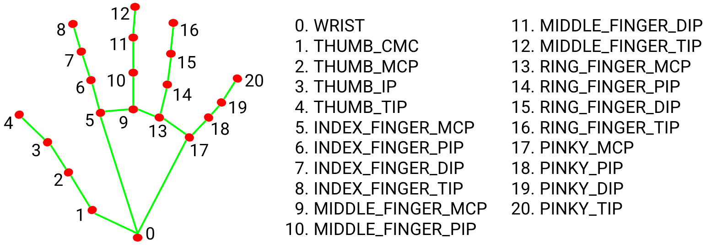

# Hand Gesture Recognition for TV control commands
> DACON TV 손동작 제어 인식 AI 경진대회\
> https://dacon.io/competitions/official/236050/overview/description


## Command 종류
* Class 0 : 스마트 TV 볼륨을 높입니다. (Thumbs up)
* Class 1 : 스마트 TV 볼륨을 낮춥니다. (Thumbs down)
* Class 2 : 스마트 TV의 재생 영상을 10초 전으로 점프합니다. (swipe left to right)
* Class 3 : 스마트 TV의 재생 영상을 10초 앞으로 점프합니다. (swipe right to left)
* Class 4 : 스마트 TV의 재생 영상을 중지합니다.  (high-five)

## 심사기준
Macro F1 Score

## Dataset 구조
```commandline
D:\Dataset\TV-hand-gesture-recognition\
    test\
    train\
    test.csv
    train.csv
```

## 손 키포인트 추출 모델
[MediaPipe by Google](https://google.github.io/mediapipe/solutions/hands.html)   
이유 : 많이 사용해보기도 했고, cpu에서도 잘 돌아가는 것이 검증되었다. 그만큼 가볍고 빠르다는 뜻이다. 성능은 역시 말할 것 없이 현존 모델 중에 최고인 것 같다.
  

## Training?
mediapipe에서 keypoint를 추출한다.
